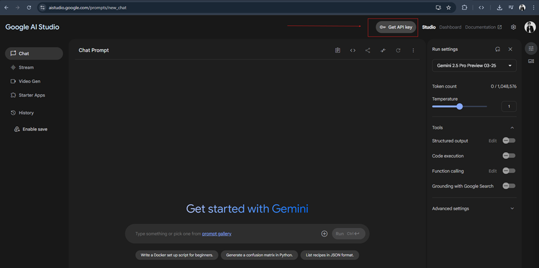
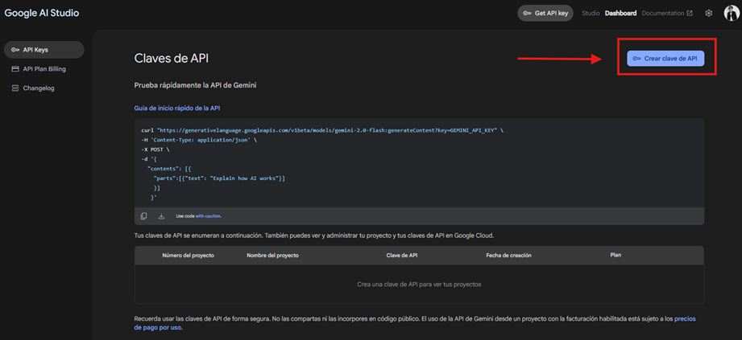
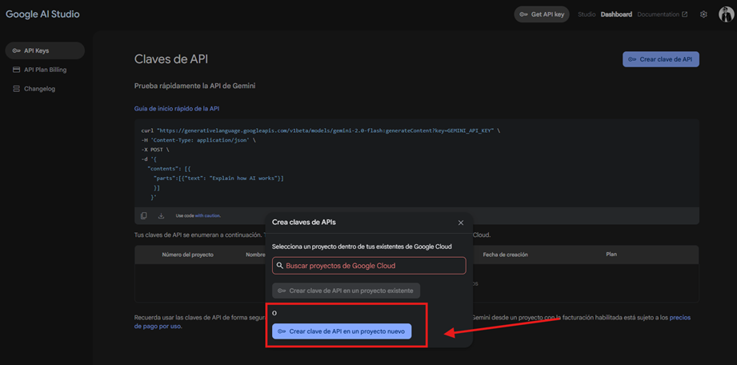
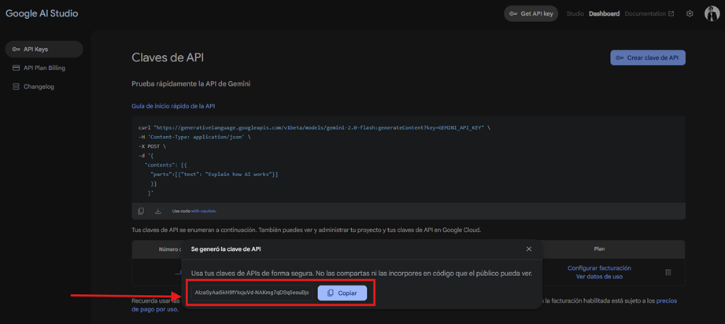
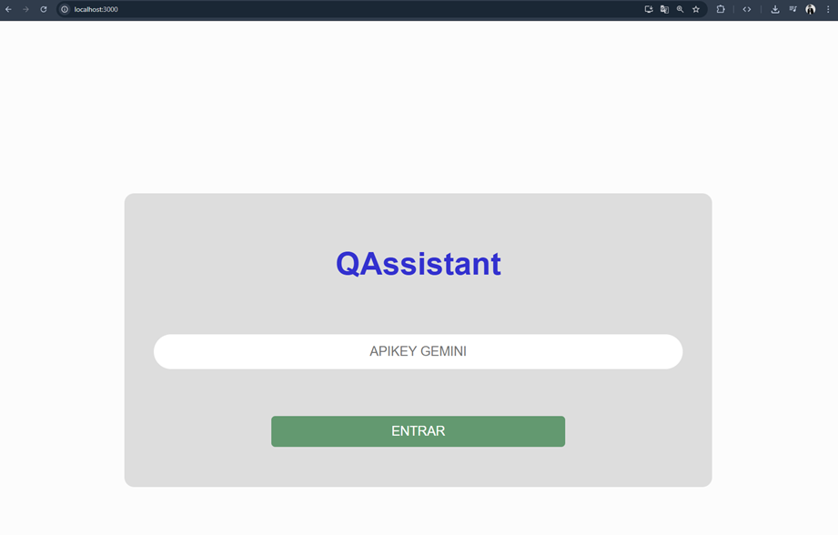
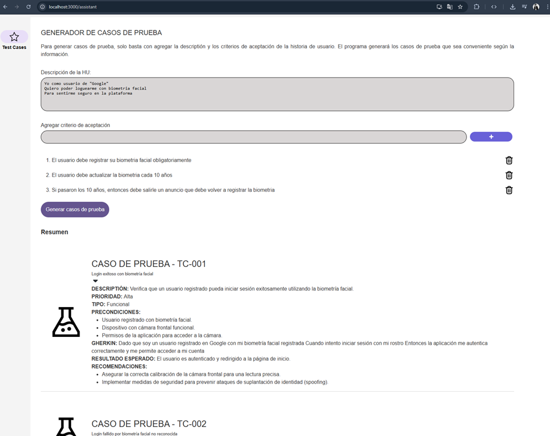

# ¿Qué  es QAssistant?
La aplicación pretende ser un asistente impulsado por inteligencia artificial para las actividades cotidianas que realiza una persona que cumple el rol de Quality Assurance en los equipos de desarrollo de software. Como se dijo anteriormente, solo es un asistente y no pretende reemplazar el rol de QA, más bien, prentende ser una herramienta que ayude a ampliar el campo visual del QA.

# ¿Qué módulos tiene la app?
Actualmente se encuentra en desarrollo los módulos:
- ✅ Generador de casos de prueba (Finalizado)
- ⌛ Refinamiento de historias de usuario. (En construcción)
- 🔬 Sugerencias en el proceso de pruebas según el contexto del equipo (En planeación)
- 🔬 Automatización de casos de prueba (En planeación)

# Pre-requisitos
1. Tener instalado Node.js para poder gestionar paquetes con npm
2.	Tener una cuenta de Google
3.	Obtener una api key gratuita de Gemini en iastudio

# ¿Cómo obtener el Apikey de Gemini?
Obtener ApiKey gratuita de Gemini (O comprar una si se quiere la versión PRO). 

1. Ingresar a [AIStudio de Google](https://aistudio.google.com/apikey)

2. Clic en "Crear clave de API"

3. Clic en "Crear clave de API en un proyecto nuevo"

4. Clic en "Copiar"

# Instalar y ejecutar repositorio
1.	Descargarlo desde: 
https://github.com/AlejoFront/app-ia
2.	Ingresar a la carpeta: app-ia
3.	Abrir una línea de comandos en la carpeta raíz
4.	Ejecutar comando: npm install y esperar que se instalen las dependencias
5.	Ejecutar el comando npm start y esperar que se inicializa la aplicación

# ¿Cómo usar la app?

1.	Ingresar a la app en: http://localhost:3000/assistant
2.	Ingresar el ApiKey de Gemini y darle a Entrar:
 
3.	Ya puedes empezar a generar casos de prueba por medio de inteligencia artificial y una historia de usuario candidata según su descripción y criterios de usuario:

# Equipo de desarrollo
- Luis Felipe Londoño Medina - ROL: QA
- Alejandro Luna Miranda - ROL: FrontEnd Developer
